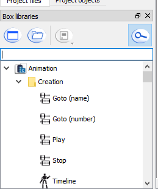
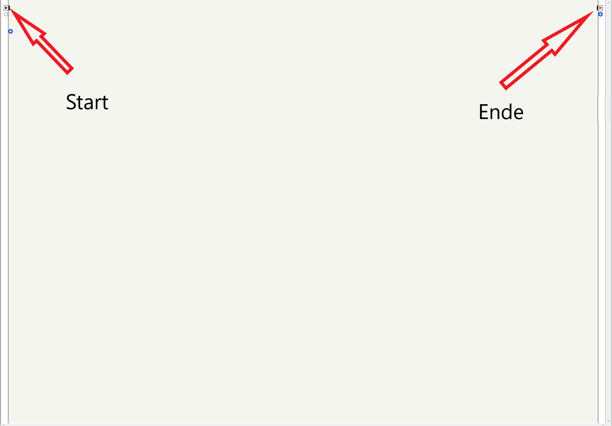
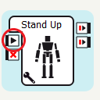
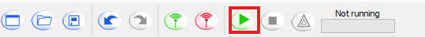
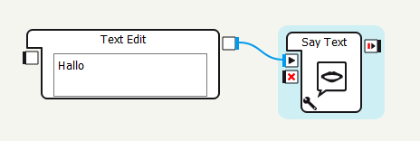
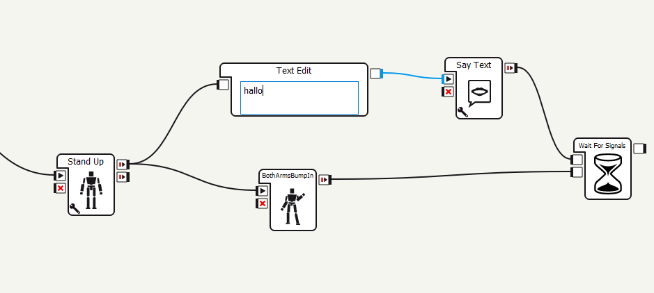

# HTL - Leonding Schnuppertag
## 1. Basic Movement

### 1a. Aufstehen und Hinsetzen

Die Aufgabenstellung ist, den Nao Roboter dazu zu bringen sich einmal hinzusetzen. Hirfür gibt es zwei Boxen die es möglich machen. Um nun eine Box zu bekommen braucht man die Box library, die sich links unten befindet.

Wie man schon in dem Bild erkennen kann, ist es möglich in der ganzen library zu suchen, wenn man die Lupe anklickt. Um den Roboter nun zum Aufstehen zu bringen, braucht man die Box `Stand Up`. Für das Niedersetzen die Box `Sit Down`.

 

Um die Boxen jetzt noch ausführbar zu machen, werden sie einfach aus der Box Library  in den großen leeren Bereich gezogen. Dort gibt es einen Startpunkt und einen Endpunkt.

Wenn man vom Startpunkt nun mit der Maus wegzieht, sollte sich eine Linie ergeben die man dann zu der eben hereingezogenen `Stand Up` Box anschließen kann.

Nun benutzen wir den oberen Anschluss auf der anderen Seite und verbinden ihn dann mit der Box `Sit Down` und am Ende zum Endpunkt. Durch Drücken auf den Play Button wird das Programm höchstwahrscheinlich am Nao abgespielt.

### 1b. Begrüßung

Jetzt wollen wir, dass der Nao uns noch begrüßt, bevor er sich wieder niedersetzt. Dafür brauchen wir die Boxen `Say Text` und `Text Edit`.

In der `Text Edit` Box wird der Text hineingeschrieben, der daraufhin der Box `Say Text` weitergegeben wird. Jetzt muss man nur noch die Blöcke an die richtige Stelle bringen und der Nao sollte sich aufsetzen "Hallo" sagen und sich wieder niedersetzen.

### 1d. Gesten

Um die Begrüßung jetzt noch ein bisschen realistischer ausschauen zu lassen, werden wir noch Gesten davor hinzufügen. Hierfür benutzen wir die Box `BothArmsBumpInFront_01`.

### 1c. **Bonus** Gleichzeitige Aktionen
Momentan schaut die Begrüßung trotzdem einfach noch ein bisschen abgehackt aus. Deswegen sollen die Aktionen jetzt gleichzeitig abgespielt werden.

Dies kann man einfach erreichen, indem man von einem Output auf beide verbindet wie oben dargestellt. Der letzte Block ganz am Ende namens `Wait For Signals` ist dafür da, dass das Programm erst erst dann weitermacht, wenn beide Abzweigungen fertig sind.

## 2. Sensoren

### 2a. Bumper Detection
In der zweiten Aufgabe wollen wir jetzt ein paar Sensoren ausprobieren. Den ersten den wir ausprobieren soll einfach, wenn man seine Hand angreift, das folgende Programm abspielen. Um dies zu erreichen, braucht man die Box `Bumpers`. Diese werden an den Start plaziert. Und je nach dem, welche Hand das Programm aktivieren soll nimmt man diesen auch und verbindet ihn mit dem Programm.

### 2b. Voice Recognition
